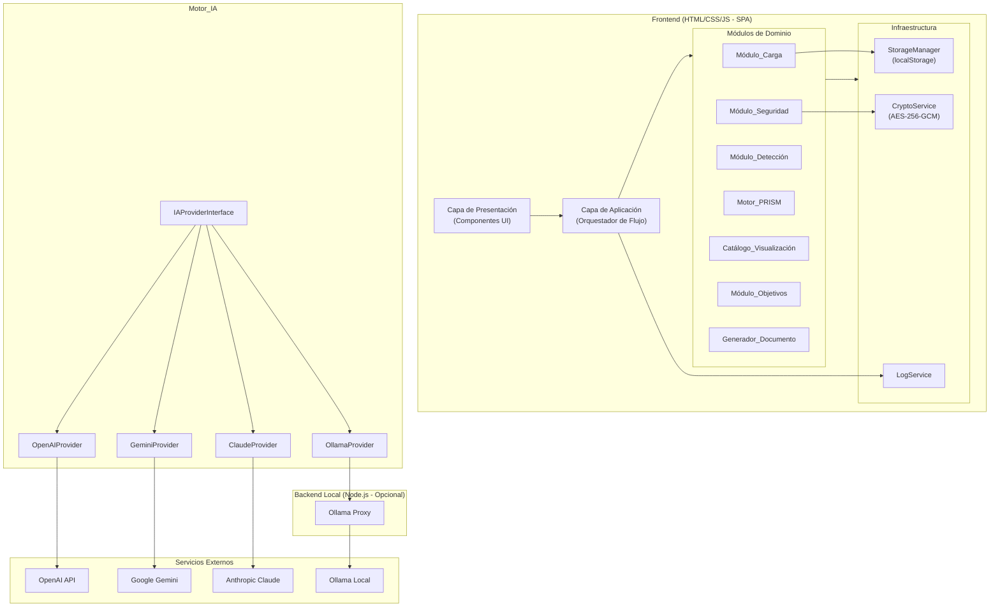
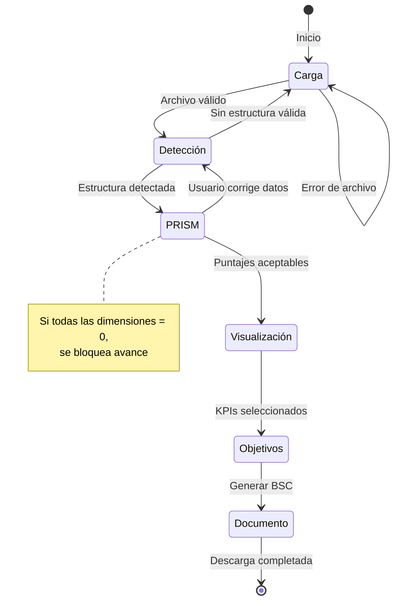
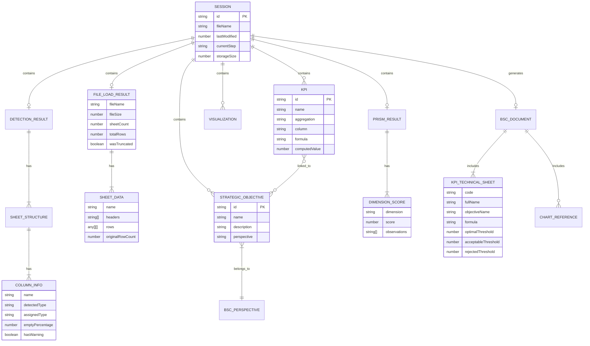
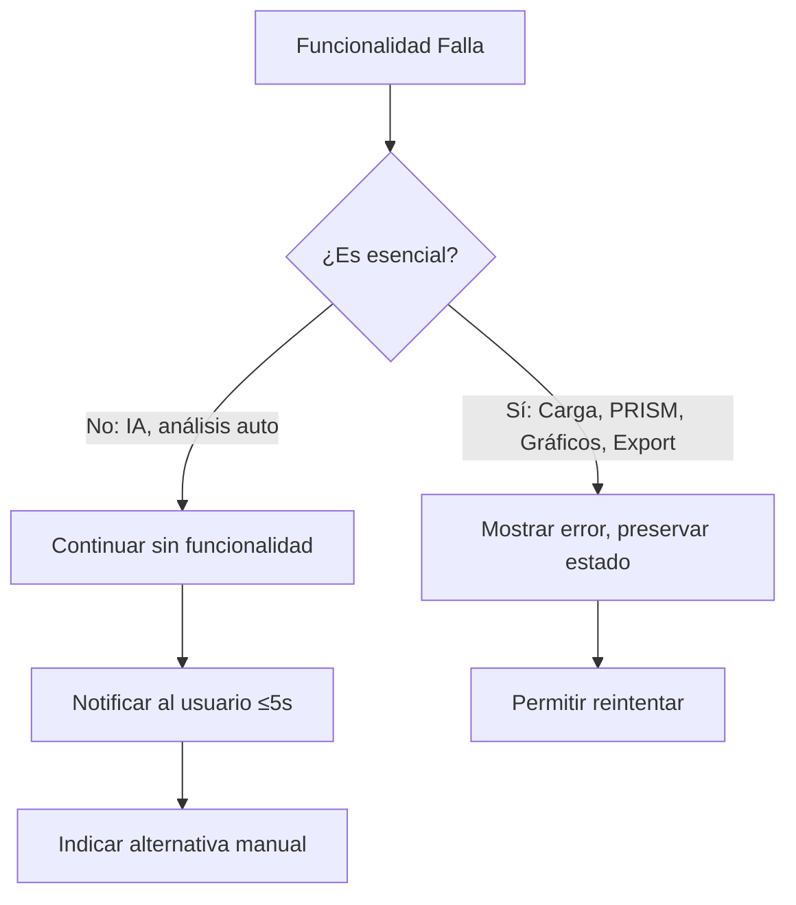

# Documento de Diseño: Dashboard Onboarding Analítico

## Overview

Este documento describe el diseño técnico del **Dashboard Onboarding Analítico Individual**, una aplicación web local-first que guía a un usuario a través de un flujo estructurado de análisis de datos: carga → detección → validación PRISM → visualización → vinculación estratégica → generación de documento BSC.

La aplicación se compone de un frontend empaquetable como archivo HTML único y un backend ligero opcional (Node.js) para integración con Ollama. Toda la lógica de negocio reside en el frontend; el backend solo sirve como proxy para modelos de IA locales.

### Principios de Diseño

- **Local-first**: Los datos nunca abandonan el dispositivo del usuario excepto hacia proveedores de IA configurados explícitamente.
- **Modular**: Cada componente tiene responsabilidad única y se comunica mediante interfaces tipadas.
- **Offline-capable**: Todas las funcionalidades core operan sin conexión a internet.
- **Extensible**: Inyección de dependencias para proveedores de IA; interfaces desacopladas entre módulos.
- **Empaquetable**: El frontend puede compilarse en un archivo HTML autónomo ≤15 MB.

---

## Architecture

### Diagrama de Arquitectura General



### Diagrama de Flujo del Usuario



### Capas de la Arquitectura

| Capa | Responsabilidad | Tecnología |
|------|----------------|------------|
| Presentación | Renderizado UI, eventos, accesibilidad | HTML5, CSS3 (con variables para temas), JS vanilla o framework ligero |
| Aplicación | Orquestación del flujo, gestión de estado | Estado centralizado (patrón Observer/Store) |
| Dominio | Lógica de negocio pura de cada módulo | TypeScript/JSDoc, funciones puras |
| Infraestructura | Persistencia, criptografía, logging | Web APIs (localStorage, SubtleCrypto, File API) |

---

## Components and Interfaces

### Módulo_Carga

```typescript
/**
 * @typedef {Object} FileLoadResult
 * @property {string} fileName - Nombre del archivo original
 * @property {number} fileSize - Tamaño en bytes
 * @property {number} sheetCount - Número de hojas (1 para CSV)
 * @property {number} totalRows - Total de filas procesadas
 * @property {boolean} wasTruncated - Si se truncó a 100K filas
 * @property {SheetData[]} sheets - Datos por hoja
 */

/**
 * @typedef {Object} SheetData
 * @property {string} name - Nombre de la hoja
 * @property {string[]} headers - Encabezados de columna
 * @property {any[][]} rows - Filas de datos (max 100,000)
 * @property {number} originalRowCount - Conteo original antes de truncado
 */

interface IModuloCarga {
    /**
     * Carga y parsea un archivo del usuario.
     * @param file - Archivo seleccionado por el usuario
     * @param onProgress - Callback de progreso (0-100)
     * @returns Resultado de la carga o error descriptivo
     */
    loadFile(file: File, onProgress: (percent: number) => void): Promise<Result<FileLoadResult, FileLoadError>>;
    
    /**
     * Valida formato, tamaño y tipo MIME del archivo.
     * @param file - Archivo a validar
     * @returns Resultado de validación
     */
    validateFile(file: File): Result<void, FileValidationError>;
    
    /** Formatos soportados */
    readonly SUPPORTED_FORMATS: readonly ['.xlsx', '.xls', '.csv'];
    
    /** Límite de tamaño en bytes (50 MB) */
    readonly MAX_FILE_SIZE: 52_428_800;
    
    /** Límite de filas */
    readonly MAX_ROWS: 100_000;
}
```

### Módulo_Detección

```typescript
/**
 * @typedef {'numeric' | 'text' | 'date' | 'boolean'} DataType
 */

/**
 * @typedef {Object} ColumnInfo
 * @property {string} name - Nombre de la columna
 * @property {DataType} detectedType - Tipo detectado automáticamente
 * @property {DataType} assignedType - Tipo asignado (puede ser modificado por usuario)
 * @property {number} emptyPercentage - Porcentaje de valores vacíos (0-100)
 * @property {number} recordCount - Cantidad de registros no vacíos
 * @property {boolean} hasWarning - Si emptyPercentage > 30
 */

/**
 * @typedef {Object} SheetStructure
 * @property {string} sheetName - Nombre de la hoja
 * @property {ColumnInfo[]} columns - Información de columnas
 * @property {number} totalRecords - Total de registros
 */

/**
 * @typedef {Object} DetectionResult
 * @property {SheetStructure[]} sheets - Estructura por hoja
 * @property {number} analyzedSheets - Hojas analizadas (max 50)
 * @property {number} skippedSheets - Hojas omitidas
 * @property {boolean} hasValidStructure - Si hay al menos una hoja con estructura tabular
 */

interface IModuloDeteccion {
    /**
     * Analiza la estructura de todas las hojas del archivo cargado.
     * Tiempo máximo: 30 segundos.
     * @param sheets - Datos cargados por Módulo_Carga
     * @returns Estructura detectada
     */
    analyzeStructure(sheets: SheetData[]): Promise<DetectionResult>;
    
    /**
     * Reasigna el tipo de una columna.
     * @param sheetIndex - Índice de la hoja
     * @param columnIndex - Índice de la columna
     * @param newType - Nuevo tipo a asignar
     */
    reassignColumnType(sheetIndex: number, columnIndex: number, newType: DataType): void;
    
    /**
     * Infiere el tipo de dato de un valor.
     * @param value - Valor a analizar
     * @returns Tipo inferido
     */
    inferType(value: unknown): DataType;
    
    /** Máximo de hojas a analizar */
    readonly MAX_SHEETS: 50;
}
```

### Motor_PRISM

```typescript
/**
 * @typedef {'precision' | 'relevance' | 'integrity' | 'sufficiency' | 'maintainability'} PRISMDimension
 */

/**
 * @typedef {Object} DimensionScore
 * @property {PRISMDimension} dimension - Dimensión evaluada
 * @property {number} score - Puntaje 0-100 (entero)
 * @property {string[]} observations - Observaciones textuales
 * @property {ProblemDetail[]} problems - Columnas/registros problemáticos (max 10)
 */

/**
 * @typedef {Object} ProblemDetail
 * @property {string} location - Identificador (columna o fila)
 * @property {string} description - Descripción del problema
 * @property {number} impact - Impacto en el puntaje (0-100)
 */

/**
 * @typedef {Object} PRISMResult
 * @property {DimensionScore[]} dimensions - 5 dimensiones evaluadas
 * @property {boolean} isBlockingQuality - Si todas = 0
 * @property {boolean} hasLowIntegrity - Si Integridad < 30
 * @property {boolean} hasWarningDimensions - Si alguna < 60
 */

interface IMotorPRISM {
    /**
     * Evalúa la calidad de los datos en las 5 dimensiones PRISM.
     * Debe ser determinista e idempotente.
     * @param structure - Estructura detectada
     * @param data - Datos del archivo
     * @returns Resultado de la evaluación PRISM
     */
    evaluate(structure: DetectionResult, data: SheetData[]): PRISMResult;
    
    /**
     * Recalcula una dimensión específica tras correcciones.
     * @param dimension - Dimensión a recalcular
     * @param structure - Estructura actualizada
     * @param data - Datos actualizados
     * @returns Score actualizado de la dimensión
     */
    recalculateDimension(dimension: PRISMDimension, structure: DetectionResult, data: SheetData[]): DimensionScore;
}
```

### Catálogo_Visualización

```typescript
/**
 * @typedef {'bar' | 'line' | 'pie' | 'scatter' | 'pivot'} ChartType
 */

/**
 * @typedef {Object} ChartSuggestion
 * @property {string} id - Identificador único
 * @property {ChartType} type - Tipo de gráfico
 * @property {string} title - Título sugerido
 * @property {string[]} columns - Columnas involucradas
 * @property {string} rationale - Razón de la sugerencia
 */

/**
 * @typedef {Object} KPISuggestion
 * @property {string} id - Identificador único
 * @property {string} name - Nombre del KPI
 * @property {'sum' | 'average' | 'count' | 'rate' | 'min' | 'max'} aggregation - Operación
 * @property {string} column - Columna principal
 * @property {string} formula - Fórmula descriptiva
 * @property {number | null} computedValue - Valor calculado con datos actuales
 */

/**
 * @typedef {Object} Visualization
 * @property {string} id - Identificador único
 * @property {ChartType} type - Tipo de gráfico
 * @property {string} title - Título (max 100 chars)
 * @property {VisualizationConfig} config - Configuración de colores, etiquetas, rangos
 * @property {string[]} dataColumns - Columnas asignadas
 * @property {boolean} isCustom - Si fue creado manualmente por el usuario
 */

interface ICatalogoVisualizacion {
    /**
     * Genera sugerencias de gráficos basadas en tipos de datos.
     * Mínimo 3 sugerencias.
     */
    suggestCharts(structure: DetectionResult): ChartSuggestion[];
    
    /**
     * Genera sugerencias de KPIs (3-10).
     */
    suggestKPIs(structure: DetectionResult, data: SheetData[]): KPISuggestion[];
    
    /**
     * Genera vista previa del gráfico (max 5 seg).
     */
    generatePreview(suggestion: ChartSuggestion, data: SheetData[]): Promise<ChartRenderData>;
    
    /**
     * Agrega visualización personalizada (max 20 custom).
     */
    addCustomVisualization(config: VisualizationConfig): Result<Visualization, VisualizationError>;
    
    /** Máximo de visualizaciones custom */
    readonly MAX_CUSTOM_VISUALIZATIONS: 20;
}
```

### Módulo_Objetivos

```typescript
/**
 * @typedef {'financial' | 'customers' | 'internal_processes' | 'learning_growth'} BSCPerspective
 */

/**
 * @typedef {Object} StrategicObjective
 * @property {string} id - Identificador único
 * @property {string} name - Nombre (max 150 chars)
 * @property {string} description - Descripción (max 500 chars)
 * @property {BSCPerspective} perspective - Perspectiva BSC
 * @property {string[]} linkedKPIIds - IDs de KPIs vinculados
 */

/**
 * @typedef {Object} KPILink
 * @property {string} kpiId - ID del KPI
 * @property {string} objectiveId - ID del objetivo
 */

interface IModuloObjetivos {
    /**
     * Crea un objetivo estratégico (max 20).
     */
    createObjective(data: Omit<StrategicObjective, 'id' | 'linkedKPIIds'>): Result<StrategicObjective, ObjectiveError>;
    
    /**
     * Vincula un KPI a un objetivo (max 5 objetivos por KPI).
     */
    linkKPI(kpiId: string, objectiveId: string): Result<KPILink, LinkError>;
    
    /**
     * Elimina vinculación KPI-objetivo.
     */
    unlinkKPI(kpiId: string, objectiveId: string): Result<void, LinkError>;
    
    /**
     * Agrupa objetivos por perspectiva BSC.
     */
    getObjectivesByPerspective(): Map<BSCPerspective, StrategicObjective[]>;
    
    /**
     * Verifica objetivos sin KPIs para advertencias.
     */
    getUnlinkedObjectives(): StrategicObjective[];
    
    /** Máximo de objetivos */
    readonly MAX_OBJECTIVES: 20;
    
    /** Máximo de objetivos por KPI */
    readonly MAX_OBJECTIVES_PER_KPI: 5;
}
```

### Motor_IA

```typescript
/**
 * @typedef {Object} IAProviderConfig
 * @property {string} providerId - Identificador del proveedor
 * @property {string} apiKey - Clave de API (se cifra al almacenar)
 * @property {string} model - Modelo específico
 * @property {string} baseUrl - URL base (para Ollama: localhost:11434)
 */

/**
 * @typedef {Object} DatasetMetadata
 * @property {string[]} columnNames - Nombres de columnas
 * @property {DataType[]} columnTypes - Tipos de cada columna
 * @property {number} rowCount - Cantidad de filas
 * @property {Record<string, StatsSummary>} statistics - Resúmenes estadísticos por columna
 */

/**
 * @typedef {Object} IAResponse
 * @property {string} content - Respuesta formateada del modelo
 * @property {string} providerId - Proveedor que respondió
 * @property {number} timestamp - Marca de tiempo
 */

interface IMotorIA {
    /**
     * Configura un proveedor de IA con validación de conectividad.
     * Timeout de prueba: 10 segundos.
     */
    configureProvider(config: IAProviderConfig): Promise<Result<void, IAConfigError>>;
    
    /**
     * Envía consulta al proveedor activo.
     * Solo envía metadatos, nunca datos individuales.
     * Timeout: 30 seg + 1 reintento tras 2 seg.
     */
    query(prompt: string, metadata: DatasetMetadata): Promise<Result<IAResponse, IAQueryError>>;
    
    /**
     * Cambia el proveedor activo preservando historial.
     */
    switchProvider(providerId: string): Result<void, IAConfigError>;
    
    /**
     * Verifica disponibilidad de Ollama en localhost:11434.
     * Timeout: 5 segundos.
     */
    checkOllamaAvailability(): Promise<boolean>;
    
    /**
     * Obtiene proveedores disponibles según conectividad.
     */
    getAvailableProviders(isOnline: boolean): IAProviderConfig[];
}

/** Interfaz que cada proveedor debe implementar */
interface IIAProvider {
    readonly providerId: string;
    readonly requiresInternet: boolean;
    
    testConnection(config: IAProviderConfig): Promise<Result<void, IAConfigError>>;
    sendQuery(prompt: string, metadata: DatasetMetadata): Promise<Result<IAResponse, IAQueryError>>;
}
```

### Generador_Documento

```typescript
/**
 * @typedef {Object} BSCDocument
 * @property {DocumentMetadata} metadata - Metadatos del análisis
 * @property {IntroductionSection} introduction - Sección introducción
 * @property {ObjectivesSection} objectives - Definición de objetivos
 * @property {DimensionsSection} dimensions - Dimensiones del CMI
 * @property {KPIIdentificationSection} kpiIdentification - Identificación de KPIs
 * @property {KPIDetailsSection} kpiDetails - KPIs con fichas técnicas
 * @property {DataSection} dataSection - Obtención de datos y gráficos
 * @property {AnalysisSection} analysis - Análisis cuantitativo/cualitativo
 */

/**
 * @typedef {Object} KPITechnicalSheet
 * @property {string} code - Nomenclatura (código abreviado)
 * @property {string} fullName - Nombre completo
 * @property {string} objectiveName - Objetivo asociado
 * @property {string} formula - Fórmula de cálculo
 * @property {ThresholdConditions} conditions - Condiciones de evaluación
 */

/**
 * @typedef {Object} ThresholdConditions
 * @property {number} optimal - Umbral óptimo
 * @property {number} acceptable - Umbral aceptable
 * @property {number} rejected - Umbral rechazado
 */

/**
 * @typedef {Object} DocumentMetadata
 * @property {string} generationDate - Fecha ISO 8601 (AAAA-MM-DD)
 * @property {string} sourceFileName - Nombre del archivo fuente
 * @property {Record<PRISMDimension, number>} prismScores - Puntajes PRISM
 * @property {string} iaProvider - Proveedor de IA utilizado
 */

interface IGeneradorDocumento {
    /**
     * Genera el documento BSC completo en formato Markdown.
     * Tiempo máximo: 30 segundos.
     */
    generate(context: DocumentGenerationContext): Promise<Result<string, DocumentError>>;
    
    /**
     * Parsea un documento Markdown BSC existente.
     * Para validación de round-trip.
     */
    parse(markdown: string): Result<BSCDocument, ParseError>;
    
    /**
     * Regenera preservando personalizaciones del usuario.
     */
    regenerate(context: DocumentGenerationContext, customizations: UserCustomizations): Promise<Result<string, DocumentError>>;
    
    /**
     * Serializa BSCDocument a Markdown.
     */
    serialize(document: BSCDocument): string;
}
```

### Módulo_Seguridad

```typescript
interface IModuloSeguridad {
    /**
     * Sanitiza texto contra XSS.
     * Escapa HTML, elimina tags de script.
     */
    sanitizeInput(input: string): string;
    
    /**
     * Cifra datos sensibles con AES-256-GCM.
     */
    encrypt(data: string): Promise<EncryptedPayload>;
    
    /**
     * Descifra datos con verificación de integridad.
     */
    decrypt(payload: EncryptedPayload): Promise<Result<string, IntegrityError>>;
    
    /**
     * Valida archivo contra criterios de seguridad.
     * Verifica: tamaño ≤ 50MB, extensión permitida, MIME type coincide.
     */
    validateFileUpload(file: File): Result<void, SecurityError>;
    
    /**
     * Genera headers CSP para la aplicación.
     */
    getCSPHeaders(): string;
    
    /**
     * Detecta intentos de inyección de scripts.
     */
    detectInjection(input: string): boolean;
}
```

### Servicios de Infraestructura

```typescript
interface IStorageManager {
    /**
     * Guarda estado de sesión serializado.
     * Límite: 100 MB total.
     */
    saveSession(state: SessionState): Result<void, StorageError>;
    
    /**
     * Restaura sesión guardada.
     */
    loadSession(): Result<SessionState | null, StorageError>;
    
    /**
     * Obtiene porcentaje de uso del almacenamiento.
     */
    getUsagePercent(): number;
    
    /**
     * Limpia todos los datos almacenados.
     */
    clearAll(): Result<void, StorageError>;
    
    /**
     * Verifica antigüedad de sesión (30 días máx).
     */
    isSessionExpired(): boolean;
    
    /** Límite en bytes (100 MB) */
    readonly MAX_STORAGE: 104_857_600;
    
    /** Umbral de advertencia (80%) */
    readonly WARNING_THRESHOLD: 0.8;
}

interface ILogService {
    /**
     * Registra error con timestamp y módulo.
     */
    logError(module: string, error: Error, context?: Record<string, unknown>): void;
    
    /**
     * Registra evento de seguridad.
     */
    logSecurityEvent(type: string, details: string): void;
    
    /**
     * Obtiene logs para consulta desde la UI.
     */
    getLogs(filter?: LogFilter): LogEntry[];
}
```

---

## Data Models

### Diagrama de Entidades



### Esquema de Estado de Sesión (localStorage)

```typescript
/**
 * Estado completo de la sesión persistido en localStorage.
 * Serializado como JSON con datos cifrados para API keys.
 */
interface SessionState {
    /** Versión del esquema para migraciones futuras */
    version: number;
    
    /** Identificador único de sesión */
    sessionId: string;
    
    /** Timestamp de última modificación */
    lastModified: number;
    
    /** Etapa actual del flujo */
    currentStep: 'upload' | 'detection' | 'prism' | 'visualization' | 'objectives' | 'document';
    
    /** Datos del archivo cargado */
    fileData: FileLoadResult | null;
    
    /** Resultado de detección de estructura */
    detectionResult: DetectionResult | null;
    
    /** Resultado de auditoría PRISM */
    prismResult: PRISMResult | null;
    
    /** Visualizaciones seleccionadas y personalizadas */
    visualizations: Visualization[];
    
    /** KPIs seleccionados */
    selectedKPIs: KPISuggestion[];
    
    /** Objetivos estratégicos definidos */
    objectives: StrategicObjective[];
    
    /** Vinculaciones KPI-Objetivo */
    links: KPILink[];
    
    /** Configuración de IA (API keys cifradas) */
    iaConfig: {
        activeProviderId: string | null;
        providers: IAProviderConfig[];
        queryHistory: IAResponse[];
    };
    
    /** Personalizaciones del usuario para regeneración */
    userCustomizations: UserCustomizations;
    
    /** Preferencias de UI */
    uiPreferences: {
        theme: 'light' | 'dark';
        locale: string;
    };
}
```

### Algoritmo de Detección de Tipos

```typescript
/**
 * Estrategia de inferencia de tipos por columna.
 * Analiza una muestra de valores y determina el tipo predominante.
 */
function inferColumnType(values: unknown[]): DataType {
    // 1. Filtrar valores nulos/vacíos
    // 2. Muestrear hasta 1000 valores para rendimiento
    // 3. Clasificar cada valor:
    //    - Numérico: parseable como float sin NaN
    //    - Fecha: coincide con patrones ISO/comunes de fecha
    //    - Booleano: true/false/1/0/sí/no
    //    - Texto: cualquier otro
    // 4. Tipo predominante (>60% de la muestra) = tipo asignado
    // 5. Si no hay tipo predominante, asignar 'text'
}
```

### Algoritmo de Evaluación PRISM

| Dimensión | Métrica | Cálculo |
|-----------|---------|---------|
| Precisión | Consistencia de tipos, outliers | `100 - (inconsistencias/total × 100)` |
| Relevancia | Columnas con datos útiles vs vacías | `(columnas_útiles / total_columnas) × 100` |
| Integridad | Completitud de datos (% no-nulos) | `(valores_presentes / total_celdas) × 100` |
| Suficiencia | Cantidad mínima de registros por columna | `min(registros/umbral × 100, 100)` |
| Mantenibilidad | Nombres descriptivos, formatos consistentes | Heurísticas de naming + formato |

---


## Correctness Properties

*Una propiedad es una característica o comportamiento que debe mantenerse verdadero en todas las ejecuciones válidas de un sistema — esencialmente, una declaración formal sobre lo que el sistema debe hacer. Las propiedades sirven como puente entre especificaciones legibles para humanos y garantías de correctitud verificables por máquina.*

### Property 1: Round-trip del Generador de Documento

*Para cualquier* contexto de generación válido (KPIs, objetivos, datos PRISM, metadatos), generar un documento Markdown, parsearlo de vuelta a una estructura BSCDocument, y re-serializarlo SHALL producir un documento estructuralmente idéntico al original en secciones, orden de secciones, fichas técnicas de KPI y tablas de análisis (excluyendo metadatos variables como fecha de generación).

**Validates: Requirements 7.11, 12.4**

### Property 2: Invariantes del Motor PRISM (Idempotencia + Rango)

*Para cualquier* dataset válido con estructura tabular, evaluar la calidad con Motor_PRISM dos veces consecutivas SHALL producir puntajes idénticos (idempotencia), y cada puntaje SHALL ser un entero en el rango [0, 100] inclusive para cada una de las 5 dimensiones.

**Validates: Requirements 3.1, 3.2, 12.3**

### Property 3: Detección Produce Estructura Válida

*Para cualquier* archivo fuente válido (formatos .xlsx, .xls, .csv con datos tabulares de hasta 50 MB y al menos una fila de encabezados seguida de al menos una fila de datos), el Módulo_Detección SHALL producir un DetectionResult con al menos una hoja, donde cada hoja contiene al menos una columna con tipo asignado (numérico, texto, fecha o booleano), nombre no vacío, y conteo de registros ≥ 1.

**Validates: Requirements 2.1, 2.2, 12.2**

### Property 4: Umbral de Advertencia en Columnas

*Para cualquier* columna detectada en cualquier hoja, el indicador `hasWarning` SHALL ser `true` si y solo si `emptyPercentage > 30`.

**Validates: Requirements 2.3**

### Property 5: Round-trip del Estado de Sesión

*Para cualquier* SessionState válido, serializarlo a JSON, almacenarlo en localStorage, y leerlo de vuelta SHALL producir un objeto equivalente al original en todos sus campos (comparación profunda excluyendo referencias de objetos).

**Validates: Requirements 8.1**

### Property 6: Round-trip de Cifrado de API Keys

*Para cualquier* cadena de texto que represente una API key, cifrarla con AES-256-GCM y descifrarla SHALL producir la cadena original idéntica.

**Validates: Requirements 9.3**

### Property 7: Detección de Integridad en Datos Cifrados Corruptos

*Para cualquier* payload cifrado válido al cual se le modifica al menos un byte del ciphertext o del authentication tag, la operación de descifrado SHALL fallar con un error de integridad (nunca retornar datos corruptos silenciosamente).

**Validates: Requirements 9.4**

### Property 8: Sanitización XSS Segura

*Para cualquier* cadena de entrada, la salida de `sanitizeInput` SHALL no contener tags `<script>`, atributos de evento (`onclick`, `onerror`, etc.), ni entidades HTML sin escapar que puedan ejecutar JavaScript. Además, el texto seguro (alfanumérico y espacios) SHALL preservarse intacto.

**Validates: Requirements 9.1**

### Property 9: Detección de Inyección de Scripts

*Para cualquier* cadena que contenga patrones de inyección reconocidos (tags script, event handlers en atributos HTML, `javascript:` URIs), `detectInjection` SHALL retornar `true`. Para cadenas compuestas exclusivamente de caracteres alfanuméricos, espacios y puntuación común, SHALL retornar `false`.

**Validates: Requirements 9.7**

### Property 10: Validación Triple de Archivos

*Para cualquier* archivo, la validación de seguridad SHALL aceptar el archivo si y solo si las tres condiciones se cumplen simultáneamente: tamaño ≤ 50 MB, extensión en {.xlsx, .xls, .csv}, y tipo MIME coincide con la extensión declarada. El incumplimiento de cualquier condición individual SHALL producir rechazo.

**Validates: Requirements 9.5**

### Property 11: Payload de IA Contiene Solo Metadatos

*Para cualquier* consulta enviada al proveedor de IA, el payload transmitido SHALL contener únicamente metadatos del dataset (nombres de columnas, tipos, número de filas) y resúmenes estadísticos (medias, medianas, distribuciones), y SHALL no contener ningún valor individual de registro del usuario.

**Validates: Requirements 6.3**

### Property 12: Correctitud de Carga de Archivos

*Para cualquier* archivo con formato soportado (.xlsx, .xls, .csv) y tamaño ≤ 50 MB, el FileLoadResult SHALL contener: fileName igual al nombre original, fileSize igual al tamaño real en bytes, sheetCount igual al número real de hojas, y totalRows ≤ 100,000. Para archivos con formato no soportado, la carga SHALL retornar un error de validación sin almacenar datos.

**Validates: Requirements 1.1, 1.2, 1.6, 1.9**

### Property 13: Round-trip de Vinculación KPI-Objetivo

*Para cualquier* KPI y objetivo estratégico existentes, vincularlos y luego desvincularlos SHALL retornar el estado de vinculaciones al estado previo exacto (el KPI no aparece en `linkedKPIIds` del objetivo, y el objetivo no aparece vinculado al KPI).

**Validates: Requirements 5.2, 5.6**

### Property 14: Límites del Módulo de Objetivos

*Para cualquier* secuencia de operaciones de creación, el sistema SHALL aceptar hasta 20 objetivos estratégicos y rechazar el objetivo número 21+. Para cualquier KPI, SHALL aceptar hasta 5 vinculaciones a objetivos distintos y rechazar la vinculación número 6+.

**Validates: Requirements 5.1, 5.2, 5.7**

### Property 15: Cotas de Sugerencias de Visualización

*Para cualquier* DetectionResult con al menos una columna numérica o temporal, el Catálogo_Visualización SHALL sugerir al menos 3 tipos de gráficos. Para KPIs, SHALL generar entre 3 y 10 sugerencias cuando existan columnas numéricas/temporales.

**Validates: Requirements 4.1, 4.2**

### Property 16: Agrupación de Objetivos por Perspectiva BSC

*Para cualquier* conjunto de objetivos estratégicos con perspectivas asignadas, `getObjectivesByPerspective()` SHALL retornar un Map donde cada objetivo aparece exactamente una vez, bajo la clave correspondiente a su perspectiva BSC asignada.

**Validates: Requirements 5.3**

### Property 17: Cambio de Proveedor Preserva Historial

*Para cualquier* secuencia de consultas realizadas al Motor_IA seguida de un cambio de proveedor activo, el historial de consultas y respuestas previas SHALL permanecer intacto y accesible tras el cambio.

**Validates: Requirements 6.7**

### Property 18: Completitud Estructural del Documento Generado

*Para cualquier* contexto de generación válido con al menos un KPI, el documento producido SHALL contener todas las secciones obligatorias (Introducción, Objetivos Estratégicos, Dimensiones del CMI, Identificación de KPIs, KPIs necesarios para el CMI, Obtención de Datos, Análisis), y cada KPI SHALL tener una ficha técnica completa (código, nombre, objetivo, fórmula, condiciones con umbrales numéricos).

**Validates: Requirements 7.1, 7.3, 7.5, 7.6, 7.7**

### Property 19: Filtrado de Perspectivas BSC en Documento

*Para cualquier* conjunto de KPIs vinculados a perspectivas, el documento generado SHALL incluir únicamente las perspectivas que tienen al menos un KPI válido, y SHALL omitir las perspectivas vacías indicando la razón de exclusión.

**Validates: Requirements 7.2, 7.12**

### Property 20: Completitud de Entradas de Log

*Para cualquier* error registrado, la entrada de log SHALL contener: timestamp (formato ISO), nombre del módulo que generó el error, y stack trace completo. Ninguno de estos campos puede ser nulo o vacío.

**Validates: Requirements 13.2**

---

## Error Handling

### Estrategia General

El sistema implementa una jerarquía de errores tipados mediante un tipo `Result<T, E>` (patrón Either/Result) que evita excepciones no controladas:

```typescript
type Result<T, E> = { ok: true; value: T } | { ok: false; error: E };
```

### Categorías de Error

| Categoría | Ejemplo | Comportamiento |
|-----------|---------|---------------|
| **Validación** | Formato incorrecto, tamaño excedido | Rechazo inmediato con mensaje descriptivo |
| **Procesamiento** | Archivo corrupto, parsing fallido | Descarte del archivo, mensaje al usuario |
| **Red** | Timeout IA, Ollama no disponible | Reintento (1 vez/2s), degradación elegante |
| **Almacenamiento** | localStorage lleno, integridad fallida | Notificación, sugerencia de acción |
| **Seguridad** | Inyección detectada, MIME inválido | Bloqueo, log del evento, notificación |

### Degradación Elegante



### Manejo por Módulo

- **Módulo_Carga**: Errores de validación retornan `Result.error` con código específico y mensaje legible. No se almacena parcialmente un archivo inválido.
- **Motor_PRISM**: Evaluación pura sin efectos secundarios. Si falla internamente, retorna puntajes de 0 con observación de error interno.
- **Motor_IA**: Timeout 30s → reintento 1 vez tras 2s → error con proveedor identificado. Cambia automáticamente a modo manual.
- **Storage**: Si `localStorage` falla, se notifica en ≤5s y se habilita exportación manual.
- **Seguridad**: Fallos de integridad crypto descartan datos y solicitan reingreso. Se registra todo en log consultable.

### Auto-guardado y Recuperación

- Guardado automático cada 30 segundos (pérdida máxima: 30s de trabajo).
- Detección de sesión previa al reabrir (≤3s).
- Si el guardado falla: notificación inmediata con sugerencia de guardado manual.

---

## Testing Strategy

### Enfoque Dual

La estrategia combina pruebas unitarias de ejemplo con pruebas basadas en propiedades (PBT) para cobertura máxima:

| Tipo | Propósito | Herramienta |
|------|-----------|-------------|
| **Unit Tests** | Casos específicos, edge cases, integración entre componentes | Vitest |
| **Property Tests** | Propiedades universales con generación aleatoria de inputs | fast-check + Vitest |
| **Integration Tests** | Flujo completo end-to-end | Vitest + mocks |
| **Static Analysis** | Convenciones, tipos, seguridad | ESLint + TypeScript strict |

### Configuración de Property-Based Testing

- **Librería**: [fast-check](https://github.com/dubzzz/fast-check) (JavaScript/TypeScript)
- **Runner**: Vitest
- **Iteraciones mínimas**: 100 por propiedad
- **Tag format**: `Feature: dashboard-onboarding-analitico, Property {N}: {título}`

### Mapeo de Propiedades a Tests

| Propiedad | Módulo Target | Generadores Necesarios |
|-----------|---------------|----------------------|
| P1: Round-trip documento | Generador_Documento | Contextos de generación arbitrarios (KPIs, objetivos, datos) |
| P2: PRISM invariantes | Motor_PRISM | Datasets tabulares aleatorios con tipos mixtos |
| P3: Detección estructura | Módulo_Detección | Archivos con hojas/columnas/tipos variados |
| P4: Warning threshold | Módulo_Detección | Columnas con % vacíos aleatorios |
| P5: Session round-trip | StorageManager | SessionState con datos arbitrarios |
| P6: Crypto round-trip | Módulo_Seguridad | Cadenas aleatorias (API keys) |
| P7: Integridad corrupta | Módulo_Seguridad | Payloads cifrados con bits corruptos |
| P8: Sanitización XSS | Módulo_Seguridad | Cadenas con patrones de inyección + texto seguro |
| P9: Detección inyección | Módulo_Seguridad | Strings maliciosos + strings seguros |
| P10: Validación archivos | Módulo_Seguridad | Files con combinaciones size/ext/MIME |
| P11: Metadata-only payload | Motor_IA | Datasets con datos + queries, interceptar payload |
| P12: Carga correcta | Módulo_Carga | Archivos válidos e inválidos generados |
| P13: Link/unlink roundtrip | Módulo_Objetivos | Pares KPI-Objetivo aleatorios |
| P14: Límites objetivos | Módulo_Objetivos | Secuencias de creación de longitud variable |
| P15: Cotas sugerencias | Catálogo_Visualización | DetectionResults con tipos variados |
| P16: Agrupación perspectiva | Módulo_Objetivos | Conjuntos de objetivos con perspectivas aleatorias |
| P17: Switch preserva hist. | Motor_IA | Secuencias query + switch |
| P18: Doc completitud | Generador_Documento | Contextos válidos variados |
| P19: BSC filtering | Generador_Documento | KPIs con perspectivas variadas |
| P20: Log completitud | LogService | Errores aleatorios en módulos variados |

### Cobertura Objetivo

- **Motor_PRISM**: ≥80% líneas
- **Módulo_Detección**: ≥80% líneas
- **Generador_Documento**: ≥80% líneas
- **Otros módulos**: ≥70% líneas (target aspiracional)

### Tests de Integración

Un test de flujo completo que:
1. Carga un archivo de ejemplo (≥100 filas, 5 columnas, tipos mixtos)
2. Ejecuta detección de estructura
3. Ejecuta auditoría PRISM
4. Genera documento
5. Verifica que el documento contiene las secciones obligatorias del Requisito 7

### Ejecución

- Suite completa: máximo 60 segundos
- CI: se ejecuta en cada push
- Reporte de fallos: nombre de test, módulo, expected vs actual

---

## Decisiones de Diseño

### ¿Por qué fast-check para PBT?

- Es la librería PBT más madura para JavaScript/TypeScript
- Integración nativa con Vitest
- Shrinking automático para encontrar el caso mínimo de fallo
- Generadores composables para estructuras de datos complejas

### ¿Por qué patrón Result en vez de excepciones?

- Hace explícitos los posibles errores en la firma de tipo
- Fuerza al consumidor a manejar el caso de error
- Compatible con composición funcional (map, flatMap)
- Evita flujos de control inesperados por excepciones no capturadas

### ¿Por qué localStorage con JSON en vez de IndexedDB?

- Simplicidad para el caso de uso (un solo usuario, datos < 100 MB)
- Sincronía en lecturas (no requiere async para acceso rápido)
- Portabilidad universal en navegadores modernos
- Trade-off: límite de ~5-10 MB por dominio en algunos navegadores → se comprime con LZ-string si necesario

### ¿Por qué AES-256-GCM para API keys?

- Cifrado autenticado (confidencialidad + integridad en una operación)
- Disponible nativamente vía Web Crypto API (SubtleCrypto)
- El tag de autenticación permite detectar corrupción/tampering
- Estándar de la industria para cifrado simétrico

### ¿Por qué inyección de dependencias para Motor_IA?

- Open/Closed Principle: agregar proveedores sin modificar código existente
- Testabilidad: inyectar mocks para pruebas sin llamadas reales
- Cumple explícitamente con Requisito 11.3
